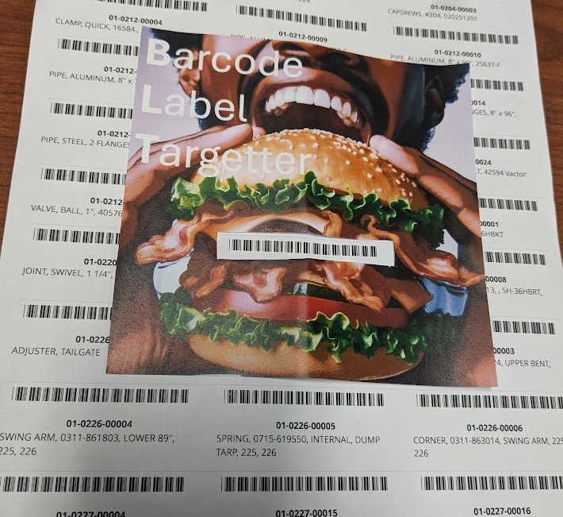

# Barcode Label Targetter (BLT)

The "Barcode Label Targetter", BLT for short, increases your precision and accuracy scanning barcodes that are close together.

💾 [**Get the BLT Template**](blt.png)

## Frequently Asked Questions (FAQs)

### The "Cut Out Here" space is too big/small. How do I fix that?

- Use print settings to print the template to the size you need.
- Cut the hole to the size you need.

### Does this template have a vegan option? Gluten-free?

- At this time, only one version of the template exists.
  If you require a BLT that meets dietary restrictions,
  please [create or vote up an issue](https://github.com/cityssm/blt/issues)
  or submit a pull request.
